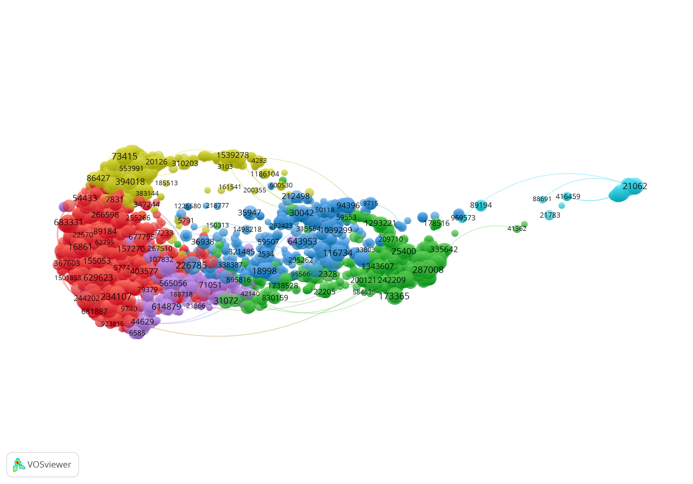

# 26th July 2019

## Dimension
Finally, I was able to fix the issues with the Dimension network file. Now I was able to perform the clusterization using the Leiden Algorithm.

Here is shown the first cluster (tweaks are still under development) 

created with these parameters 

## Analysis

### Questions:
1. Can we classify publications as DH using an external list of DH journals?
1. Using a partially completed list of DH journals, is possible to discover other DH journals?
2. Can we retrieve the percentage of DH publications for each journal, and confront it among the DBs?

With Silvio, we started to think about the possible analysis: 

* We will use the list of DH journals (similar to the ERIH list used for the previous evaluation) in order to compute the percentage of publications within clusters indexed in those journals. 

* **RESULT 1:** Then, we set a threshold (e.g. 40%). So, we can say that all the publications inside clusters with a percentage equal of greater than it are DH. These clusters are named as DH clusters.

* **RESULT 2:** At this point we may have discovered other DH journals, not from the input list.

* **RESULT 3** For each journal we can get the total number of publications indexed among all the DBs (union set operation) and then, for each of them, calculate their percentage of DH. Moreover, the same percentages can be shown as a matrix with all DBs. Also with the DBs grouped as Open or Business.

* **OTHER RESULTS:** ???
